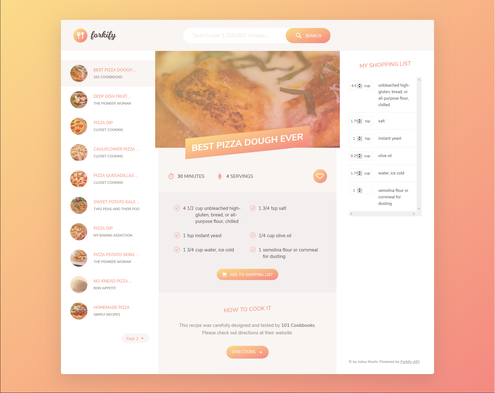

# Forkify Web App
> A recipe searching web app.

## Table of contents
* [General info](#general-info)
* [Screenshots](#screenshots)
* [Technologies](#technologies)
* [Setup](#setup)
* [Features](#features)
* [Status](#status)
* [Inspiration](#inspiration)
* [Contact](#contact)

## General info
The goal of this project is to show my portifolio to the world.

## Screenshots

## Technologies
* Visual Studio Code
* HTML
* CSS
* JavaScript
* NPM
* Webpack
* Babel
* Node.js
* Command Line

## Setup
* Installed Node.js and NPM
* Installed and configured Webpack Dev Server
* Installed Babel
* Implemented MVC architecture

## Features
Features ready:
* Search for recipe
* Display recipe and ingredients on UI
* Add ingredients to shopping list
* Like recipe

To-do list:
* None

## Status
Project is: _finished_

## Inspiration
Project based on online course I took on Udemy.

## Contact
Created by Julius Mushi - feel free to contact me!
